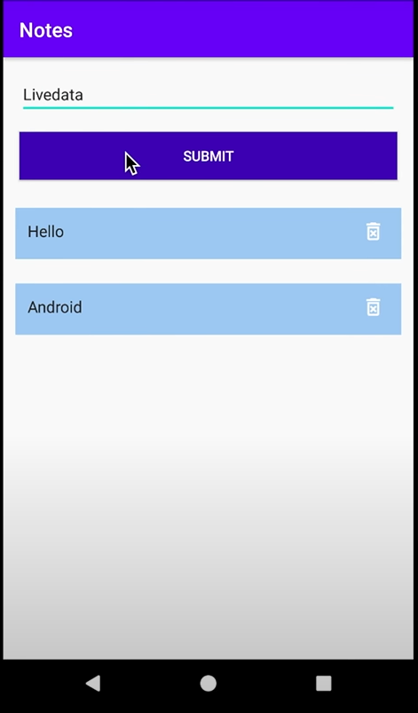
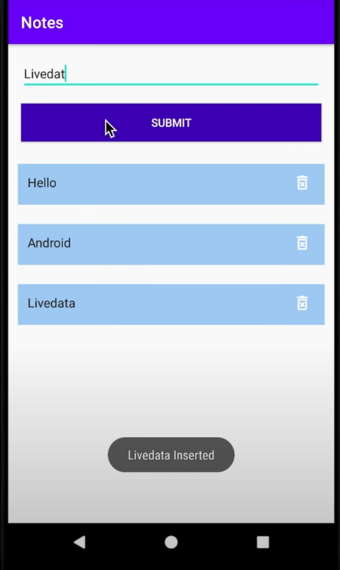

# Notes-App

### An app in which you can create your own notes and also delete it if required. The notes are displayed with the help of recycler view and this app follows the modern MVVM architecture consisting of DAO, database, viewModel, Repository, Activity and more.

# This app uses a similar architecture to the [***MVVM (Model View View-Model)***](https://developer.android.com/jetpack/docs/guide#recommended-app-arch) architecture.

 

# 1.Overview of Notes App:

 

 
 

# 2.Enter a note and click on submit button 

 

 
 

# 3.We can see that the note has been added as a part of recycler view.

 

 
 

# 4. Also on clicking submit button a toast message is shown:

 

 
 

# 5.Similarly we can see the same for another note:

 

 
 

 

 
 

# 6.Similarly we can delete a note by clicking on the delete button :
 

 
 

# 7.Then the note is deleted and a toast message also appears:

 

 
 
